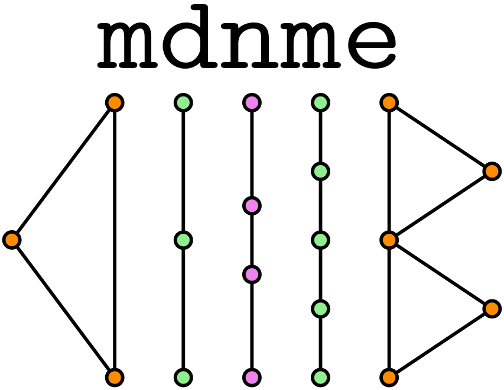

# `mdnme`: A posteriori error estimates for mixed-dimensional Darcy flow using non-matching grids

  

**mdnme** is a Python package created to perform a posteriori error analysis for finite-volume approximations to the mixed-dimensional Darcy flow problem using non-matching grids. The package is build on top of [Porepy](https://github.com/pmgbergen/porepy) and uses (the latest open source version of) [quadpy](https://github.com/sigma-py/quadpy) for numerical integration.

## Installation from source via `conda`

Please, refer to the [installation instructions](Install.md).

## Reproducing the examples of the paper

Examples from the article "A posteriori error estimates for mixed-dimensional Darcy flow using non-matching grids" can be reproduced by running the file `main.py` in each example from the `examples` directory.

Each file outputs different `txt` files containing the numerical results reported in the paper. You can also visualize the local error estimators by opening the generated `vtu` files in a proper visualization software e.g., [Paraview](https://www.paraview.org).

## Citing

If you use **mdmne** in your research, we ask you to cite the following reference:

todo: Add arxiv reference.

## Create an issue
For feature requests, troubleshootin and bug reports, please create an [issue](https://github.com/jhabriel/non_matching_estimates).

## License
See [license md](./LICENSE.md).
